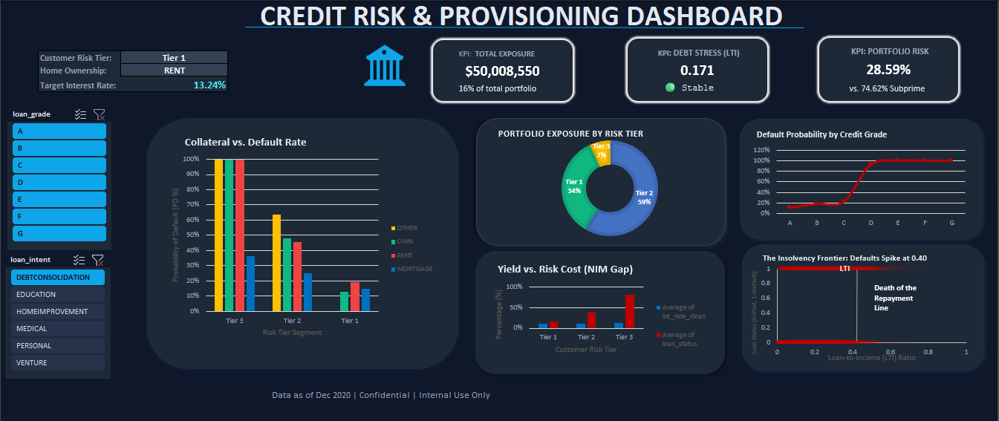
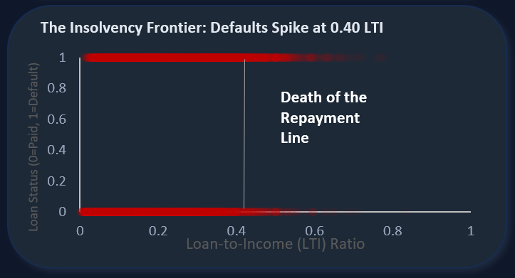
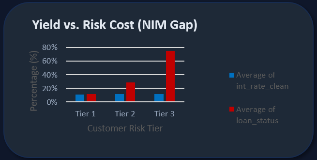

  <h1>🏦 Credit Risk Segmentation & Expected Loss Analysis (SQL + BigQuery)</h1>
  
<i>End-to-End ETL Pipeline, Expected Loss approximation using PD × Exposure × LGD assumption, and Risk-Adjusted Pricing Strategy</i>

   

  <h3>Project Overview</h3>
  

    This project analyzes a loan portfolio to identify high-risk customer segments and estimate expected credit losses.   
    The goal is to answer three key questions:
     - Which borrowers are most likely to default?
     - Where is the bank underpricing risk?
     - What actions can reduce potential losses?
      
    Using SQL (BigQuery) and Python, I built a pipeline to clean the data, engineer risk features, segment customers, and estimate expected loss.
  

   

  

  

    <b>Analyst:</b> Christopher Oroo | <b>Status:</b> Completed
  

---

##  Table of Contents
1. [Executive Summary: The Bottom Line](#i-executive-summary-the-bottom-line)
2. [Financial Risk Insights](#ii-financial-risk-insights)
3. [The CRO Action Plan: Strategic Recommendations](#iii-the-cro-action-plan-strategic-recommendations)
4. [Technical Implementation](#iv-technical-implementation)
5. [Reproducibility](#v-reproducibility)
6. [Limitations & Assumptions](#vi-limitations--assumptions)

> ** Glossary of Key Banking Terms Used in this Report:**
> *   **LTI (Loan-to-Income):** The percentage of a borrower's income required to service the loan.
> *   **PD (Probability of Default):** The historical likelihood that a borrower will fail to repay.
> *   **EAD (Exposure at Default):** The total dollar amount at risk.
> *   **ECL (Expected Credit Loss):** An IFRS 9 accounting standard calculating required capital reserves (PD × EAD × LGD).
> *   **NIM (Net Interest Margin):** The profitability metric; Interest Earned minus the Cost of Risk.
> *   **MAR (Missing At Random):** A statistical proof that missing data does not hide systemic bias.

---

## I. Executive Summary: The Bottom Line
**Problem:** The bank is currently operating with an **18% capital charge** and realizing a loss on **100% of its Tier 3 Renter segment**. The legacy credit grading system fails to account for **Debt Capacity**, leading to severe under-pricing of portfolio risk and a degraded Net Interest Margin (NIM).

**Strategy:** Architected a tri-tier risk framework in Google BigQuery, deploying a **Governed View Layer** to resolve a 9.56% data documentation gap, and engineered high-signal predictive metrics (e.g., LTI Ratios).

**Financial Impact:**
*   **Identified $12.5M in "Toxic Exposure":** Confirmed a 100% historical default rate within this sample for high-LTI Renters.
*   **Systemic Loss Avoidance:** Proposed a 0.30 LTI Cap to stop the cycle of toxic originations, protecting future liquidity from recurring $12.5M annual write-offs.
*   **NIM Restoration:** Recommended a **14.5% interest rate floor** for Prime Renters to flip a negative Net Risk Margin into profitability.

---

## II. Financial Risk Insights

### 1. Model Failure: The Flaw in Legacy Credit Grades
Testing the bank's traditional Credit Grades (A-G) revealed a massive underwriting blind spot: **Debt beats historical behavior.**
*   **The Flaw:** A "Grade A" applicant with a perfect history but massive new debt (Tier 3 LTI) exhibits a default rate spike to **66.3%**. The legacy system ignores current debt capacity.
*   **The Toxic Tail:** Any loan graded D, E, F, or G has a default rate over 50%. These segments are guaranteed capital drains.

### 2. The "Insolvency Frontier"

The analysis reveals a **"Hard Wall"** for Renters at **0.40 LTI**. Beyond this threshold, Probability of Default (PD) becomes extremely high within this dataset, making the segment un-priceable regardless of interest yield.

### 3. Multivariate Risk Discovery: The "Collateral Buffer"
By cross-tabulating LTI Risk Tiers against Home Ownership, I isolated severe risk concentrations alongside hyper-stable "Safe Harbors."

| Risk Tier | Ownership | Volume | Default Rate (PD) | Exposure at Default (EAD) |
| :--- | :--- | :---: | :---: | :--- |
| **Tier 3 (Subprime)** | **RENT** | 754 | **100.00%** | **$12.57M** |
| **Tier 2 (Standard)** | **RENT** | 8,040 | **39.91%** | **$90.04M** |
| **Tier 2 (Standard)** | MORTGAGE | 5,309 | 16.12% | $77.84M |
| **Tier 1 (Prime)** | OWN | 1,162 | **0.95%** | $7.28M |

*   **The Systemic Threat:** Tier 2 Renters are the bank's largest "Hidden Fire," carrying a 39.9% default rate across $90M in exposure.
*   **The Collateral Buffer:** Outright Owners in Tier 1 display an ultra-stable 0.95% PD. Tier 2 Mortgage holders default at less than half the rate of their Renter counterparts (16.1% vs 39.9%).

### 4. Root Cause Analysis: The "Intent" Illusion 
Isolating Tier 3 Renters exposed a systemic failure where debt-stress overrides loan intent. Once an LTI of ~0.47 is reached, mathematical capacity to repay breaks completely.

| Loan Intent | Volume | Default Rate (PD) | Avg. LTI | Status |
| :--- | :---: | :---: | :---: | :--- |
| Medical / Debt Cons. | 301 | 100.00% | ~0.470 | 🔴 Toxic |
| **Home Improvement** | **75** | **100.00%** | **0.478** | **potential misclassification** |
| Education / Venture | 254 | 100.00% | 0.472 | 🔴 Toxic |

*   **The "Home Improvement" Paradox (Abnormal behavior Alert):** I identified 75 "Home Improvement" loans issued to Renters that resulted in a 100% loss. While this intent may represent legitimate furniture financing, the high loan values (~$17.6k) coupled with a 100% default rate suggests a breakdown in **Verification of Assets (VOA)**. Whether this represents occupancy misrepresentation or aggressive consumption, this category is functionally un-priceable.

### 5. Financial Modeling: IFRS 9 Provisioning & Yield Audit

**Business Goal:** Quantify capital reserve requirements and identify "Negative Spread" segments by comparing Interest Yield vs. Expected Credit Loss (ECL) under IFRS 9 accounting standards.

| Risk Tier | Total Exposure | PD % | Required Reserves | Avg. Yield | Loss Intensity |
| :--- | :--- | :---: | :---: | :---: | :---: |
| **Tier 1 (Prime)** | $109M | 11.89% | **$9.07M** | 10.63% | 8.32% |
| **Tier 2 (Standard)**| $182M | 28.84% | **$36.87M** | 11.39% | **20.19%** |
| **Tier 3 (Subprime)**| $20.7M | 74.62% | **$10.82M** | 11.71% | **52.23%** |

*   **The Yield-to-Loss Deficit:** The bank charges an 11.39% yield in Tier 2 but faces a 20.19% Loss Intensity, creating an **8.8% net leak** on every dollar lent.
*   **The Capital Trap:** Tier 2 consumes **$36.8M in Required Reserves**. This "trapped capital" severely depresses the bank's Return on Equity (ROE).

---

## III. The CRO Action Plan: Strategic Recommendations
To restore the Net Interest Margin (NIM) and protect core capital, I recommend a three-pillar remediation strategy:

**1. Elimination & Provisions (Non-Viable Segments)**
*   **Origination Moratorium:** Immediately halt all lending to Tier 3 Renters to preserve future capital. Reclassify the $12.5M exposure from "Expected Loss" to "Realized Loss" (Write-off) to reflect true liquidity.
*   **Forensic Fraud Audit:** Mandate an immediate investigation into the 75 "Home Improvement" Renter loans for misrepresentation at origin.
*   **ECL Adjustment:** Increase IFRS 9 provisions for the Tier 2 Renter segment ($90M exposure) to account for the discovered 39.9% default rate.

**2. Risk Filtering (Underwriting Migration Control)**
*   **LTI "Circuit Breaker":** Implement an automated Hard LTI Cap of 0.30 for all unsecured Renter applications.
*   **Grade Override:** Regardless of a perfect Credit Grade (A/B), any applicant exhibiting an LTI > 0.40 must be automatically rejected.

**3. Repricing (Margin Correction)**
*   **Collateral-Adjusted Pricing:** Implement a mandatory **15% "Unsecured Surcharge"** for non-homeowners. 
*   **Rate Floors:** Reprice Tier 1 Renters to a minimum **13.24% floor** to achieve a 2% profit buffer above the cost of risk. If a ~30% required yield for Tier 2 Renters is not market-viable, the bank must exit the segment entirely.

---

## IV. Technical Implementation 

**Data Pipeline**
*   Built using **Google BigQuery (SQL)** and **Python (Pandas)**
*   Structured using layered transformations:
    *   **Raw Layer:** Original dataset
    *   **Clean Layer:** Missing value handling and type correction
    *   **Feature Layer:** Derived variables (LTI, default history)
    *   **Segmentation Layer:** Risk tier classification

**Data Quality Checks**
*   Verified row-level integrity between raw and processed data (no data loss)
*   Identified ~9.5% missing values in key variables (interest rate, employment length)
*   Applied group-based imputation (by loan grade)
*   Compared default rates before/after imputation → no material distortion observed

**Key Engineered Features**
*   **Loan-to-Income (LTI):** Proxy for debt burden
*   **Default History Flag:** Captures prior credit behavior
*   **Risk Tier (Derived):**
    *   Tier 1: Low risk
    *   Tier 2: Moderate risk
    *   Tier 3: High risk

**Modeling Approach**
*   Estimated Expected Loss using: `Expected Loss ≈ PD × Exposure × LGD`
*   PD derived empirically from dataset
*   LGD assumed constant (simplification)

---

## V. Reproducibility

To replicate this analysis:
1. Load dataset into BigQuery
2. Run SQL scripts in `/scripts/sql/` folder (in order)
3. Execute Python notebook for validation & exports
4. Use exported CSV files for dashboard creation (Excel/Power BI)

---

## VI. Limitations & Assumptions
*   **PD Estimation:** Based on historical averages (no predictive model yet)
*   **LGD:** Assumed constant (not modeled due to lack of recovery data)
*   **Correlation Effects:** Variables treated independently
*   **Dataset Scope:** Synthetic dataset, results illustrate methodology, not real-world portfolio behavior
