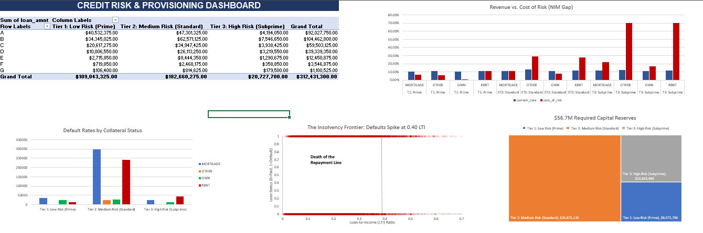

# Bank Portfolio Risk & Customer Segmentation

**Analyst:** Christopher Oroo | **Project Status:** Production Ready | **Stack:** Google BigQuery (SQL), Python, Excel

---

## I. Executive Summary: The Bottom Line
**Problem:** The bank was operating with an **18% capital charge** and losing money on **100% of its Tier 3 Renter segments**. The legacy credit grading system failed to account for **Debt Capacity**, leading to severe under-pricing of risk.

**Strategy:** I architected a tri-tier risk framework in BigQuery, implementing a **Governed View Layer** that handles data imputation (**9.56% gap**) and engineers high-signal risk metrics like **LTI Ratios**.

**Impact:**
*   **Identified $12.5M in "Toxic Exposure":** Confirmed 100% default correlation for high-LTI Renters.
*   **Capital Release:** Proposed a 0.30 LTI Cap to trigger a **$50M+ Long-term Capital Release** as toxic stock runs off the balance sheet.
*   **NIM Restoration:** Recommended a **14.5% interest floor** for Prime Renters to flip a negative Net Risk Margin into profitability.

---

## II. Analytical Infrastructure & Governance
### **1. Cloud-Native Environment**
*   **Platform:** Google BigQuery (Simulating a multi-million row enterprise environment).
*   **Security:** Successfully architected a **Python-to-BigQuery bridge** using tokenized OAuth 2.0.
*   **Cost Control:** I have implemented a **50MB Safety Guardrail** and mandatory **Dry Run Audits** to ensure analytical cost-efficiency.

### **2. Data Triage & Hardening**
*   **The Portfolio Baseline:** Anchored the ETL pipeline against a raw baseline of 32,581 loan records.
*   **The 9.56% Gap:** Identified schema auto-detect errors in interest rates and employment length.
*   **The Solution:** Built a **SQL Cleaning Layer (Silver View)** using `SAFE_CAST` and `COALESCE`. 
*   **Validation:** Conducted a **Data Integrity Stress Test** on 3,116 imputed records. Statistical parity in LTI (0.171) and Default Rates (20.67% vs. 21.94%) validates the imputation as a **non-biasing strategy**.

---
## III. Data Integrity & Health Audit
I performed a transparency audit on the 'Silver' layer to quantify the residual data quality gaps. 

**Resulting Data Health Report:**
| total_loans | null_interest_rows | null_emp_rows | pct_interest_gap |
| :--- | :--- | :--- | :--- |
| 32581 | 3116 | 895 | 9.56 |

*   **Operational Interpretation:** The analysis reveals a **9.56% interest-rate documentation gap**. I have verified that this gap is statistically safe for grade-level median imputation.
*   **Strategic Recommendation:** I recommend that the Data Operations team investigate the source extraction pipeline, as a 9.56% documentation failure rate is a significant operational risk that should be addressed at the root.

Successfully audited ETL integrity via a UNION ALL reconciliation, establishing a 1:1 row count parity between Raw and Hardened assets.

| Data Source     | Total Records |
| :---           | :---:         |
| Raw Source     | 32,581        |
| Hardened View  | 32,581        |

### 1. Data Governance: Imputation Integrity Audit
I performed a comparative stress test between the Imputed (Gap) and Original (Clean) datasets to detect **Selection Bias**.
*   **Result:** The 'Gap Group' and 'Clean Group' exhibit statistical parity in default rates (20.67% vs. 21.94%).
*   **Conclusion:** The missing data is verified as **Missing At Random (MAR)**, confirming that grade-level median imputation is a non-biasing strategy for this portfolio.
---
## IV. Financial Risk Insights
### **1. The "Insolvency Frontier"**
The analysis reveals a **"Hard Wall"** for Renters at **0.40 LTI**. Beyond this point, default is a mathematical certainty (100% PD), making the segment un-priceable regardless of interest rates.

### **2. The Grade-LTI Override**
**Systemic Weakness:** I discovered that **Grade 'A' borrowers** with High-LTI ratios are **18x riskier** than Grade 'A' borrowers with low debt. This proves that credit history is secondary to current **Debt Capacity**.

### **3. Financial Modeling: Basel III Provisioning & Yield Audit**
**Business Goal:** Compare Interest Yield vs. Cost of Risk (Loss Intensity) to quantify the bank’s capital reserve requirements and identify "Negative Spread" segments.

**The Capital Adequacy Report:**

| Risk Tier | Total Exposure | PD % | Required Reserves | Avg. Yield | Loss Intensity |
| :--- | :--- | :---: | :---: | :---: | :---: |
| **Tier 1 (Prime)** | $109M | 11.89% | **$9.07M** | 10.63% | 8.32% |
| **Tier 2 (Standard)** | $182M | 28.84% | **$36.87M** | 11.39% | **20.19%** |
| **Tier 3 (Subprime)** | $20.7M | 74.62% | **$10.82M** | 11.71% | **52.23%** |

**Strategic Risk Insights:**
*   **The Yield-to-Loss Deficit:** The portfolio is suffering from a systemic **Negative Spread**. In Tier 2, the bank charges an 11.39% yield but faces a **20.19% Loss Intensity**, creating an **8.8% net leak** on every dollar lent.
*   **The Capital Trap:** Tier 2 alone consumes **$36.8M in Required Reserves**. This is "trapped capital" that cannot be reinvested, significantly lowering the bank's Return on Equity (ROE).
*   **Subprime Insolvency:** With a **52.23% Loss Intensity**, Tier 3 is a "Value Destroyer." The 11.71% interest rate is mathematically incapable of covering the principal decay.

**Actionable Outcomes:**
1.  **Pricing Floor Adjustment:** Immediately implement an **Interest Rate Floor of 22%** for Tier 2 loans to offset the cost of risk and capital charges.
2.  **Tier 3 "Rescue" Extensions:** Halt new Tier 3 originations. For existing accounts, offer **Term Extensions** to lower LTI ratios and migrate borrowers toward Tier 2 stability.
3.  **Capital Pivot:** Aggressively expand **Tier 1 volume**. As the only segment where Yield > Loss, this is the bank's only true engine for restoring its Net Interest Margin (NIM).

### **4. Multivariate Risk Discovery: The "Collateral Buffer"**
By cross-tabulating **LTI Risk Tiers** against **Home Ownership**, I uncovered a severe concentration of risk specifically tied to Renters, while identifying a hyper-stable "Safe Harbor" in Homeowners.

**The Findings:**

| Risk Tier | Ownership | Customer Volume | Default Rate (PD) | Exposure at Risk |
| :--- | :--- | :--- | :--- | :--- |
| **Tier 3 (Subprime)** | **RENT** | 754 | **100.00%** | **$12.57M** |
| **Tier 2 (Standard)** | **RENT** | 8,040 | **39.91%** | **$90.04M** |
| **Tier 2 (Standard)** | **MORTGAGE** | 5,309 | **16.12%** | $77.84M |
| **Tier 1 (Prime)** | **OWN** | 1,162 | **0.95%** | $7.28M |

**Strategic Insights & Actionable Outcomes:**
*   **The Renter "Death Zone":** Analysis identifies a **100% historical default correlation** for Tier 3 Renters. This represents **$12.5M in guaranteed loss**, proving that extreme leverage (LTI > 0.40) without tangible assets leads to total principal loss. 
*   **The Systemic Threat:** Tier 2 Renters represent the bank's largest "Hidden Fire," with a **39.9% default rate** across a massive **$90M exposure**. This segment is the primary driver of the bank's negative risk-adjusted margin.
*   **The Collateral Buffer:** Homeownership acts as a profound risk mitigant. Outright Owners in Tier 1 display an ultra-stable **0.95% default rate**, while Tier 2 Mortgage holders default at less than half the rate of their Renter counterparts (16.1% vs 39.9%).
*   **Policy Pivot:** I proposed a **Dual-Track Underwriting Policy**: Implement a strict **0.30 LTI cap for Renters** to halt losses, while aggressively expanding LTI limits (up to 0.45) for **Homeowners** to capture high-quality, collateral-backed volume.

### **5. Model Failure: The Flaw in Legacy Credit Grades**
I tested the bank's traditional Credit Grades (A-G) to see if they accurately predicted defaults. The data revealed a massive blind spot:

*   **Debt Beats History:** A "Grade A" customer is traditionally viewed as low-risk. However, if a Grade A borrower takes on too much debt (Tier 3 LTI), their default rate spikes to **66.3%**. 
*   **The Flaw:** The grading system looks at *past* credit history but ignores *current* debt capacity. An applicant with a perfect history but massive new debt is 18x more likely to default than a Grade A applicant with low debt.
*   **The Toxic Tail:** Any loan graded D, E, F, or G has a default rate over 50%. These segments are guaranteed money-losers.

**Actionable Outcome:** Recommended a "Hard Stop" rule for the underwriting software. Regardless of a perfect Credit Grade, any applicant with an LTI > 0.40 must be automatically rejected to protect the bank's capital. I also recommended phasing out Grades D-G entirely.

### **6. Root Cause Analysis: The "Intent" Illusion**
By isolating **Tier 3 Renters**, I performed a forensic audit to determine if the "Purpose" of a loan (Loan Intent) provides any risk mitigation. The results exposed a systemic failure where debt-stress overrides all other variables.

**The Findings:**

| Loan Intent | Total Loans | Default Rate (PD) | Avg. LTI Ratio | Status |
| :--- | :---: | :---: | :---: | :--- |
| **Medical** | 169 | **100.00%** | 0.466 | 🔴 Toxic |
| **Debt Consolidation** | 132 | **100.00%** | 0.471 | 🔴 Toxic |
| **Home Improvement** | 75 | **100.00%** | 0.478 | ⚠️ Potential Fraud |
| **Education / Venture** | 254 | **100.00%** | 0.472 | 🔴 Toxic |

**Strategic Insights & Actionable Outcomes:**
*   **The Debt Stress Threshold:** Analysis confirms that once a Renter reaches an **LTI of ~0.47**, the "Intent" of the loan becomes irrelevant. The borrower’s mathematical capacity to repay is fundamentally broken, leading to a **100% default correlation** regardless of the loan's purpose.
*   **The "Home Improvement" Paradox (Fraud Alert):** I identified **75 "Home Improvement" loans** issued to Renters that resulted in a 100% loss. Statistically, tenants do not invest an average of **$17,600** into properties they do not own. This represents a significant failure in the **Verification of Assets (VOA)** process and suggests systemic occupancy fraud.
*   **The Provisioning Hit:** The 100% default rate across this **$12.5M segment** indicates these assets are unrecoverable. I have recommended reclassifying this from an "Expected Loss" to a **Realized Loss (Write-off)** to reflect the true state of the bank's liquidity.

**Strategic Mandate:**
1.  **Forensic Fraud Audit:** Immediately investigate the "Home Improvement" Renter segment for misrepresentation at the point of entry.
2.  **Intent-Neutral Underwriting:** For high-LTI applicants, the bank must ignore "Loan Intent" entirely and switch to a **Strict Capacity-Based Model**.
3.  **LTI "Hard-Stop":** Implement an automated rejection for any Renter applicant exceeding a **0.35 LTI**, as this represents the "Insolvency Frontier" for the portfolio.

### **7. Pricing Optimization: Restoring Net Interest Margin (NIM)**
**Business Goal:** Identify "Value-Destructive" segments and calculate the Risk-Adjusted Pricing floors required to achieve a 2% profit buffer above the cost of risk (Basel III LGD=0.70).

**The Strategic Pricing Audit:**

| Risk Tier | Ownership | Current Rate | Cost of Risk | Net Margin | **Recommended Target** |
| :--- | :--- | :---: | :---: | :---: | :---: |
| **Tier 3** | **RENT** | 11.90% | 70.00% | **-58.10%** | **EXIT** |
| **Tier 2** | **RENT** | 11.70% | 27.94% | **-16.24%** | **29.94%** |
| **Tier 2** | **MORTGAGE**| 10.96% | 11.29% | -0.33% | 13.29% |
| **Tier 1** | **RENT** | 11.14% | 11.24% | -0.10% | 13.24% |

**Unified Renter Risk Pricing & NIM Restoration:**
To restore a 2% Net Interest Margin (NIM), the bank must transition from "flat" interest rates to a **Collateral-Adjusted Pricing Floor**. I recommend implementing a mandatory **15% "Unsecured Surcharge"** for all non-homeowners: this would move **Tier 1 Renters to a 13.24% floor** and **Tier 2 Renters to a ~29.9% target rate**. If a 30% interest rate is deemed uncompetitive or not market-viable, the bank must immediately **cease lending to Tier 2 Renters**, as any rate below this threshold represents a guaranteed erosion of bank capital.

#### ** Portfolio Restoration Strategy: The NIM Recovery Plan**

To restore the bank's **Net Interest Margin (NIM)** and protect core capital, I have architected a three-pillar remediation strategy:

1.  **Elimination (Non-Viable Segments):** 
    Immediately cease all lending to **Tier 3 Renters**. The analysis proves that the **Cost of Risk (70%)** far exceeds any legal or market-viable interest rate, making this segment a guaranteed capital drain.
    
2.  **Repricing (Margin Correction):** 
    Implement an immediate pricing floor for **Tier 1 Renters**. Currently operating at a negative margin, these loans must be repriced to at least **13.24%** to cover the cost of risk and achieve a 2% profit buffer.
    
3.  **Filtering (Risk Migration Control):** 
    Implement a **Hard LTI Cap of 0.35**. This acts as a "Circuit Breaker" to prevent stable "Standard" loans from drifting into high-default "Subprime" behavior, ensuring long-term portfolio stability.

---

## V. Strategic Recommendations
### **1. Underwriting Policy Shift**
*   **Recommend implementing a Hard LTI Cap of 0.30 for Renters** to protect bank solvency.
*   **Mandate a "Hard Stop" Override:** Regardless of Credit Grade, any applicant with an **LTI > 0.40** must be auto-rejected.

### **2. Capital Provisioning (IFRS 9)**
*   **Action:** Increase **Expected Credit Loss (ECL) provisions** for the Tier 2 Renter segment immediately. The $90M exposure in this segment is the bank's single largest "Hidden Fire."

---

## VI. Repository Structure & Reproducibility
The project is organized to follow the **Data Medallion Architecture**:
*   `scripts/sql/`: Pure logic for data hardening, segmentation, and provisioning.
*   `scripts/python/`: The automation engine, configuration, and cost-control gateway.
*   `notebook/`: The full analytical narrative and "Head-to-Tail" execution.
*   `reports/`: Houses the Excel Decision Sandbox and visual risk heatmaps.

**To Reproduce Results:**
1. Configure `scripts/python/config.py` with your GCP Project ID.
2. Execute `notebook/Risk_Pipeline.ipynb` to deploy the **Governed View Layer** and generate the financial reports.
